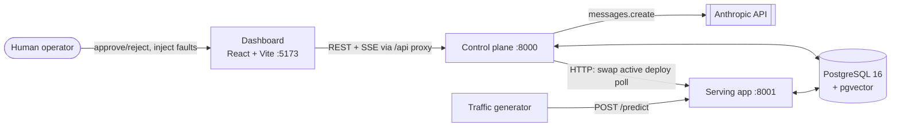
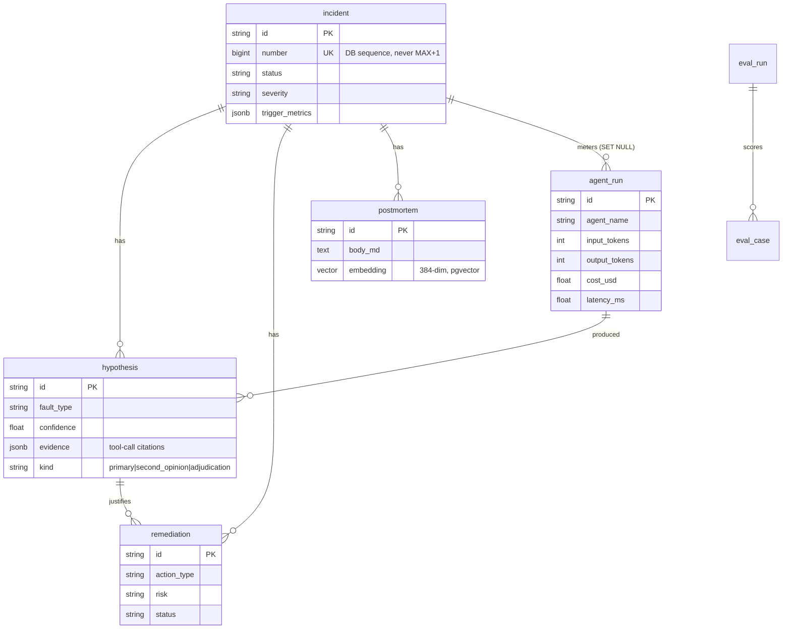
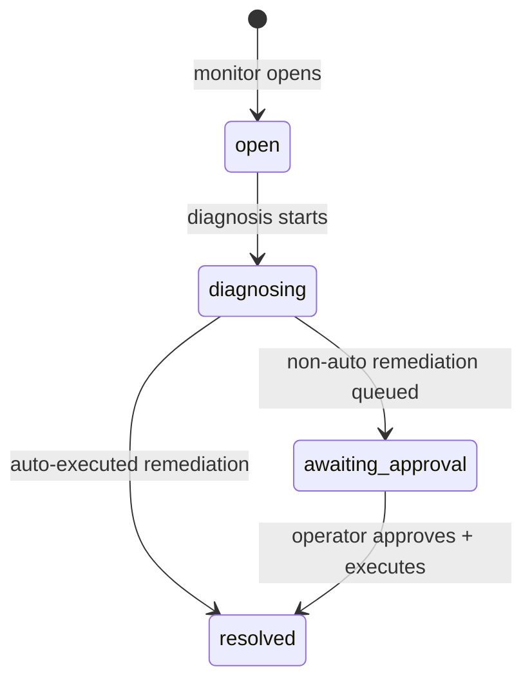
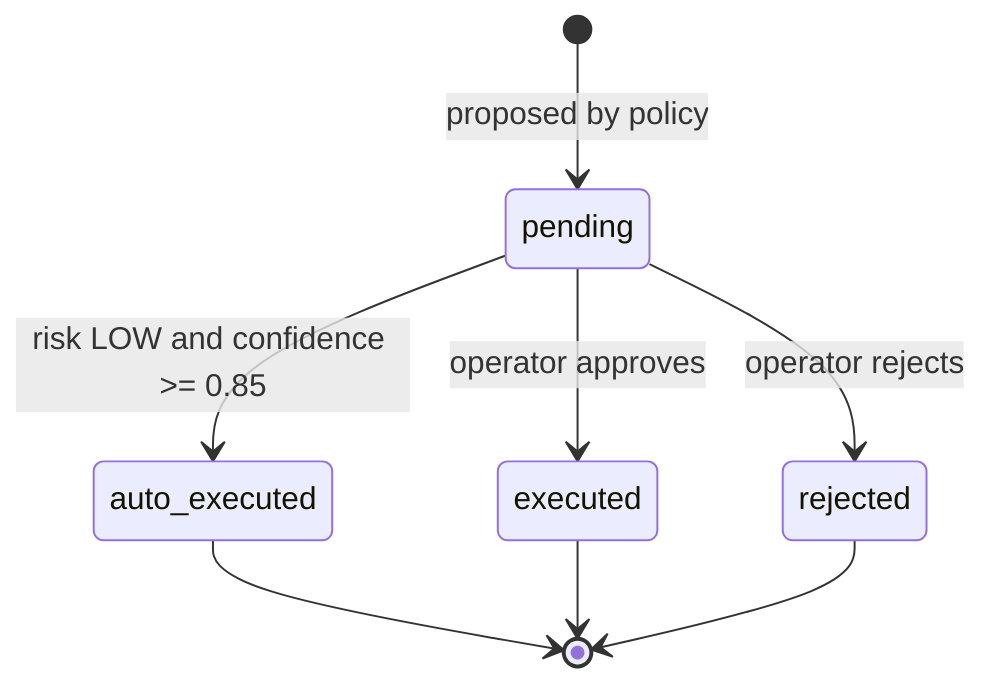

# Architecture — MLOps Incident Commander

Living picture of the whole current system. Diagrams show what exists; the Key Decisions log holds
the durable "why". Update the affected diagram and append a decision whenever the system's shape changes.

## System context

External actors and systems around the boundary.



## Components

Internal pieces and how they connect. The two FastAPI processes coordinate through the DB, not a
control API — the only inter-process HTTP is traffic → serving `/predict`.

```mermaid
flowchart TB
    subgraph control[Control plane process :8000]
        routers[Routers] --> services[Services]
        services --> queries[db/queries.py]
        agg[Metrics aggregator<br/>30s loop] --> graph
        subgraph graph[LangGraph agent graph]
            monitor[monitor<br/>cheap model] --> diagnosis[diagnosis<br/>strong model]
            diagnosis --> second[second_opinion]
            second --> adjud[adjudicator]
            diagnosis --> remed[remediation]
            adjud --> remed
        end
        graph --> queries
        broker[[SSE broker<br/>in-process]]
    end
    subgraph serving_proc[Serving process :8001]
        serving_app[FastAPI /predict] --> mw[latency-injection middleware]
        cnn[CIFAR-10 CNN]
        traffic[Traffic generator loop]
    end
    diagnosis -->|stdio| mcp[4x read-only MCP tool servers]
    mcp --> queries
    queries --> db[(PostgreSQL + pgvector)]
    serving_app --> db
    traffic --> serving_app
    routers -.SSE.-> broker
    graph -.publish.-> broker
```

## Key flow — detect → diagnose → remediate → postmortem

The core lifecycle end to end. Low-confidence diagnosis (`< 0.6`) forks into a second opinion +
adjudication; the policy table (not the LLM) decides action and whether it auto-executes.

```mermaid
sequenceDiagram
    participant TR as Traffic gen
    participant SV as Serving :8001
    participant AG as Aggregator (30s)
    participant GR as Agent graph
    participant MCP as MCP tools
    participant DB as Postgres
    participant OP as Operator

    TR->>SV: POST /predict (image, active injections applied)
    SV->>DB: write prediction_log
    AG->>DB: roll last 30s into metric_window (PSI, latency pXX, entropy)
    AG->>GR: process_window(window_id)
    GR->>GR: monitor triages vs reference profile
    alt window is anomalous
        GR->>DB: insert incident (OPEN), publish incident_opened
        GR->>MCP: diagnosis investigates (<=12 tool calls)
        GR->>DB: insert primary hypothesis, mark DIAGNOSING
        opt confidence < 0.6
            GR->>MCP: independent second_opinion
            GR->>GR: adjudicator reconciles (agreement short-circuits the LLM)
        end
        GR->>DB: decide_policy(fault, confidence) -> action, risk; insert remediation (PENDING)
        alt risk LOW and confidence >= 0.85
            GR->>SV: auto-execute (rollback swaps active deploy)
            GR->>DB: remediation AUTO_EXECUTED, incident RESOLVED
        else
            GR->>DB: incident AWAITING_APPROVAL, publish remediation_queued
            OP->>DB: approve -> execute -> incident RESOLVED
        end
        GR->>DB: generate + embed postmortem (feeds future diagnoses)
    end
```

## Data model

Core incident-lifecycle entities and their FK relationships. Sensing tables (`deploy`,
`reference_profile`, `prediction_log`, `serving_log`, `metric_window`, `injection`) are linked to
models by a `model_version` string, not FKs, and are read by the aggregator and MCP tools.



## State machine — Incident

Only reachable transitions are drawn. A rejected remediation leaves its incident in
`awaiting_approval` (no automatic transition out). The `remediating` enum value exists but is never
assigned — see Key Decisions.



## State machine — Remediation



## Key Decisions

### 2026-07-24 — Two independent FastAPI processes over one shared database

**Status:** Accepted
**Context:** The system has a live model server under synthetic load and a control plane that must
observe it without being in its request path. Options: one process; two processes talking over an
internal API; two processes sharing a database.
**Decision:** Two uvicorn processes — serving (`:8001`) and control plane (`:8000`) — that share one
Postgres. The only inter-process HTTP is the traffic generator → serving `/predict`. Control reads
serving's effects (`prediction_log`, `serving_log`) from the DB and influences serving only by
swapping the active deploy row, which serving polls. The DB models/session package (`backend.app.db`)
is imported by both processes.
**Consequences:** No API coupling or versioning between the two; the DB is the integration contract.
Serving and the traffic loop depend on `backend/` for models — the packages are not independently
deployable. Cross-process consistency relies on committed rows being visible (the aggregator commits
a window before posting it to the graph).

### 2026-07-24 — Remediation policy table is authoritative; the LLM only rationalizes

**Status:** Accepted
**Context:** An LLM proposes remediations for detected faults. Letting model output directly pick and
execute an action is unsafe and non-deterministic.
**Decision:** `domain/policy.py` maps `(fault_type, confidence)` → `(action, risk)` deterministically
and is authoritative. The remediation agent receives the policy table and returns only a *rationale*
(logged, never acted on). Auto-execution requires `risk == LOW and confidence >= 0.85`; a
`confidence < 0.5` LOW action is bumped to MEDIUM so a shaky diagnosis can never auto-execute.
**Consequences:** Actions are auditable and reproducible independent of model behavior. New fault
types require a policy entry, not just a prompt change.

### 2026-07-24 — All LLM output validated with `extra="forbid"` and fail-closed

**Status:** Accepted
**Context:** Agent nodes mutate incident/hypothesis/remediation state from model output.
**Decision:** Every LLM-output model uses `ConfigDict(extra="forbid")` and is `model_validate`d before
any state mutation. On parse failure, API error, or tool-call-cap exhaustion, nodes fail closed
(`FaultType.UNKNOWN`, low confidence; adjudicator falls back to the higher-confidence read) rather
than mutating on malformed data.
**Consequences:** Malformed model output degrades to a safe, high-risk-gated path instead of
corrupting state or executing an unintended action.

### 2026-07-24 — Fault ground truth hidden from the diagnosis agent

**Status:** Accepted
**Context:** The injection harness knows the true fault; the diagnosis agent must earn its conclusion.
**Decision:** `deploy.is_faulty` and the injection's `ground_truth_fault` are never exposed through the
MCP tools (`mcp_servers/_common.py::deploy_dict` omits `is_faulty`). Only the eval runner reads ground
truth, and only to score.
**Consequences:** Diagnosis accuracy in the eval harness reflects genuine metric-based inference. Any
new MCP tool must preserve this — leaking ground truth silently invalidates the evals.

### 2026-07-24 — Postmortem memory via pgvector semantic retrieval

**Status:** Accepted
**Context:** Past incidents should inform future diagnoses without hard-coding rules.
**Decision:** Postmortems are embedded (`sentence-transformers`, 384-dim) into a pgvector column with
an ivfflat index; diagnosis retrieves the top-3 similar past postmortems as **advisory** context.
Retrieval is best-effort — a failure logs and returns empty, never blocking diagnosis.
**Consequences:** Adds `torch`/`sentence-transformers`/`pgvector` to the dependency surface and an
embedding step per postmortem. Memory quality compounds with incident history; retrieval is
explicitly advisory, so a bad match cannot force a wrong diagnosis.

### 2026-07-24 — Human-facing incident numbers from a DB sequence

**Status:** Accepted
**Context:** Incidents need stable, monotonic, human-facing numbers; concurrent opens must not collide.
**Decision:** `incident.number` is backed by a Postgres `Sequence` (`incident_number_seq`), not
`MAX(number)+1`. Public row IDs remain app-generated prefixed tokens (`domain/ids.py`).
**Consequences:** Numbers are gap-tolerant but collision-free under concurrency. Two identifier schemes
coexist deliberately: opaque IDs for references, sequence numbers for humans.

### 2026-07-24 — Unused terminal statuses retained in the enums

**Status:** Accepted
**Context:** `IncidentStatus.REMEDIATING` and `RemediationStatus.APPROVED`/`FAILED` are defined but no
code path assigns them; remediation executes synchronously (approve → execute in one step) and a
rejected remediation leaves its incident in `awaiting_approval`.
**Decision:** Keep the values as the documented target vocabulary; the state-machine diagrams draw only
the transitions that actually occur.
**Consequences:** The enums over-describe the current runtime. If async/multi-step remediation or an
incident-close-on-reject path is added later, these become reachable — update the diagrams and
supersede this entry then.
