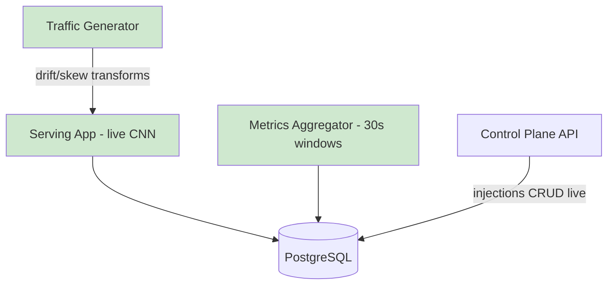

## §01 · Concept
> Unchanged — see SKELETON §01

## §02 · Architecture

No new entities; deploy, injection, prediction_log, serving_log, metric_window, reference_profile become live. Routes made real: /api/metrics/windows, /api/injections*, /api/deploys*.

## §03 · Tech Stack
> Unchanged — see SKELETON §03

## §04 · Backend

- **Serving:** loads active deploy weights at startup and on activation signal; /predict runs the CNN, logs to prediction_log; latency middleware reads the active latency injection (poll active injections from DB every 5 s) and sleeps accordingly; structured logs to serving_log. Two model versions seeded: v1.0-good and v1.1-bad (is_faulty: true, degraded weights) for the bad-deploy fault.
- **Traffic generator:** async task sampling CIFAR-10 test images at ~5 req/s; applies active injection transforms — feature drift = brightness/noise shift; label skew = altered class sampling mix. Records nothing itself; ground truth lives on injection.
- **Metrics aggregator:** 30 s task computing metric_window from prediction_log: latency percentiles, mean confidence, prediction entropy, class distribution, PSI vs reference_profile (seeded from a clean warm-up run).
- **Injection endpoints:** create/stop; POST /injections validates fault_type ∈ {feature_drift, latency, bad_deploy, label_skew}; bad_deploy activates v1.1-bad, stop reverts.
- Gotchas addressed: async Alembic bridge already configured; settings cache mutated in test fixtures; incident numbering later will use DB sequences, not MAX+1.

## §05 · Frontend

- / dashboard: MetricCharts for latency p95, PSI, entropy, class mix — polling via TanStack Query (5 s); explicitly switched to SSE in ITER_03.
- /inject: create/stop injections, list active + past with ground-truth labels.
- Loading/error/empty states on both via a shared QueryBoundary component.
- Per family convention, incidents/approvals/postmortems/costs/evals nav items are not rendered yet.

## §06 · LLM / Prompts
> Unchanged — see SKELETON §06