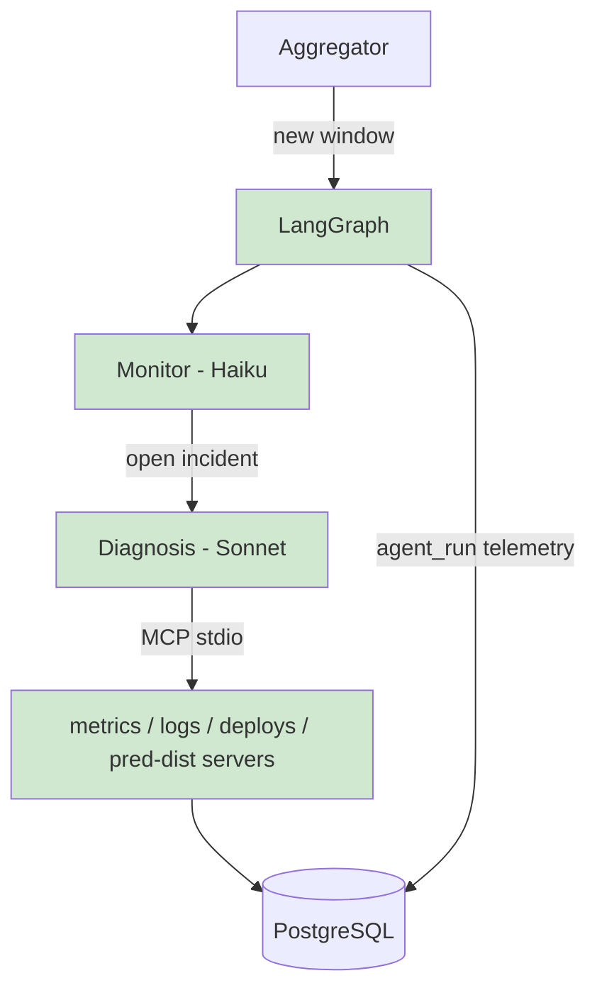

## §01 · Concept
> Unchanged — see SKELETON §01

## §02 · Architecture

Entities live: incident, agent_run, hypothesis. Routes made real: /api/incidents*, /api/agent-runs, /api/costs/summary. Incident IDs via DB sequence (concurrency gotcha).

## §03 · Tech Stack

New: mcp Python SDK (servers + client), tiktoken-free costing (token counts from Anthropic API usage fields; per-model $/token table in config). Pointer otherwise — see SKELETON §03.

## §04 · Backend

- **MCP servers** (mcp_servers/, four small stdio servers I author): metrics_server (query windows by range), logs_server (search serving_log), deploys_server (deploy history + active version), preddist_server (class distribution + PSI/KS stats for a window range). Each exposes 1–3 typed tools; read-only DB access.
- **LangGraph graph** (agents/graph.py): aggregator posts each new window into the graph. Monitor node (Haiku) receives window + baseline, outputs {open_incident, severity, reason}; on open, creates incident and routes to Diagnosis node (Sonnet), which investigates via the MCP client and must return a schema-valid Hypothesis with evidence citing tool calls. Hard cap: 12 tool calls per diagnosis run — on breach, the run fails closed with a low-confidence hypothesis.
- **Telemetry:** a wrapper around every model call writes agent_run (tokens from API usage, cost from tier table, wall latency). /api/costs/summary aggregates per agent, per incident, per day.
- LLM role-constraint gotcha: tool results transformed to user-role tool_result blocks in the message builder; no system entries in the messages array.

## §05 · Frontend

New: /incidents list and /incidents/:id (timeline: trigger metrics → hypothesis with confidence + evidence citations → agent runs with cost/latency), /costs view ("each incident costs $0.0X to triage"). Nav items for both now rendered. Polling per ITER_01 convention.

## §06 · LLM / Prompts

Real system prompts for monitor and diagnosis. Diagnosis prompt enumerates the incident taxonomy (four fault types + unknown), requires cited evidence per claim, and instructs confidence calibration. Context strategy: diagnosis context = incident trigger window + tool results only; hard cap plus tool-result truncation to 2k tokens each keeps runs bounded (context-overflow gotcha addressed now, extended in ITER_04). Evaluation deferred to ITER_05.