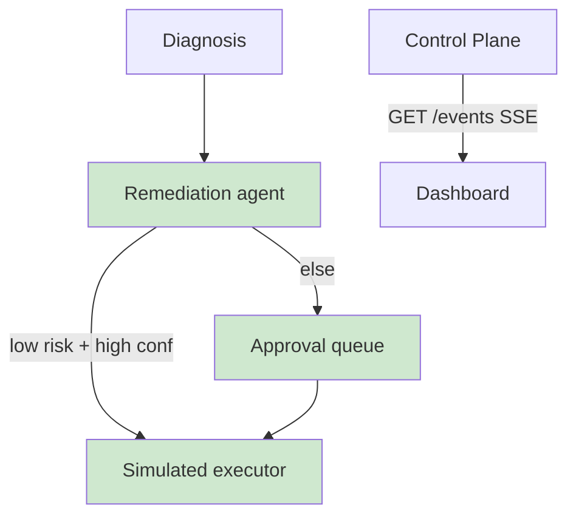

## §01 · Concept
> Unchanged — see SKELETON §01

## §02 · Architecture

Entity live: remediation. Routes real: /api/remediations/{id}/approve|reject, /api/events.

## §03 · Tech Stack
> Unchanged — see SKELETON §03

## §04 · Backend

- **Remediation node** (Sonnet): maps accepted hypothesis → action via an explicit policy table (fault_type × confidence → action + risk). Auto-execute iff risk == low AND confidence ≥ 0.85; otherwise status: pending.
- **Simulated executors:** rollback = activate prior non-faulty deploy (real state change, safe); retrain_trigger and pipeline_fix = recorded state transitions with synthetic completion after a delay. Incident status advances to resolved on execution.
- **SSE (/api/events):** shared-async-queue composition — one producer per event source (metrics window, incident opened, hypothesis ready, remediation queued/executed), one heartbeat producer (15 s ping), single consumer yields to client (heartbeat gotcha). GET with no custom headers, so native EventSource works (no auth in MVP).
- Approval endpoints are idempotent; approving an already-executed remediation returns 409.

## §05 · Frontend

- /approvals: pending remediations with hypothesis summary, risk badge, approve/reject.
- EventFeed wired to EventSource; dashboard and incident pages switch from polling to SSE-driven invalidation (fulfilling ITER_01's stated switch). StrictMode double-mount guarded with useRef on the EventSource init.
- Nav item for approvals now rendered.

## §06 · LLM / Prompts

Remediation prompt: input = accepted hypothesis + policy table; output = typed {action_type, risk, rationale} validated against the policy (the LLM proposes, the policy table is authoritative — disagreement resolves to the table). Pointer otherwise — see ITER_02 §06.