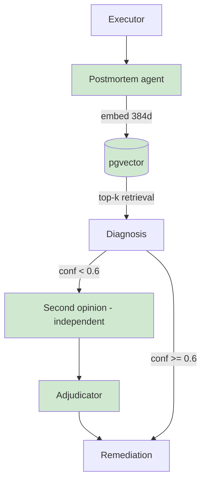

## §01 · Concept
> Unchanged — see SKELETON §01

## §02 · Architecture

Entity live: postmortem (with embedding vector(384), ivfflat index). Routes real: /api/postmortems*. hypothesis.kind values second_opinion and adjudication now produced.

## §03 · Tech Stack

New: sentence-transformers (pinned to a 384-dim all-MiniLM-L6-v2; pin matters because embedding dims are baked into the column), pgvector SQLAlchemy extension. Pointer otherwise — see SKELETON §03.

## §04 · Backend

- **Dynamic routing:** diagnosis confidence < 0.6 triggers a second independent diagnosis run (fresh context, no sight of the first hypothesis); adjudicator node (Sonnet) receives both hypotheses + evidence and emits kind: adjudication with the accepted fault_type. Agreement short-circuits the adjudicator.
- **Postmortem agent:** on incident resolution, writes structured markdown (timeline, root cause, evidence, action taken, ground truth if injection ended), embeds, stores.
- **Memory retrieval:** diagnosis context now prepends top-3 postmortems by cosine similarity to the trigger-window summary, each truncated to 500 tokens — context budget still bounded (extends ITER_02 §06 strategy, doesn't contradict it).

## §05 · Frontend

- /postmortems: list + rendered markdown detail; incident detail page gains second-opinion/adjudication steps in the timeline and a "similar past incidents" panel. Nav item now rendered.

## §06 · LLM / Prompts

Second-opinion prompt = diagnosis prompt verbatim (independence by construction). Adjudicator prompt: compare evidence quality, output accepted hypothesis + reasoning. Retrieval-augmented diagnosis prompt notes past postmortems are advisory context, not ground truth. Pointer otherwise — see ITER_02 §06.