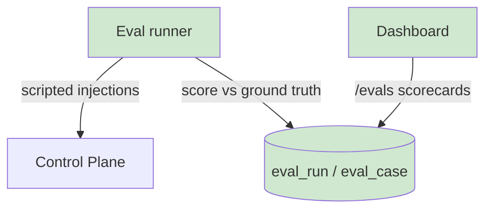

## §01 · Concept
> Unchanged — see SKELETON §01

## §02 · Architecture

Entities live: eval_run, eval_case. Routes real: /api/eval/runs*.

## §03 · Tech Stack
> Unchanged — see SKELETON §03

## §04 · Backend

- **Eval runner** (POST /api/eval/runs, background task): resets transient state (open incidents, active injections), then replays the scenario suite sequentially — 13 cases: 3 per fault type at varied severities + 1 no-fault control for false-positive measurement. Per case: start injection → await pipeline outcome (timeout 10 min) → score: detected (incident opened during window), diagnosis_correct (accepted hypothesis fault_type == ground truth), ttd_seconds (injection start → incident open), cost_usd (sum of the incident's agent_runs). Aggregates to detection recall, diagnosis accuracy, mean MTTD, mean cost per incident. Suite versioned (suite_version) so scorecards are comparable across prompt-tuning rounds — this is the instrument for the diagnosis-quality risk.
- **Demo mode:** ?demo=1 scripted single-fault narrative (inject drift → watch the full loop) driven by the same runner with pacing.

## §05 · Frontend

- /evals: run trigger, run history, ScorecardTable (the interview results table), per-case drill-down linking to the underlying incident. Nav item now rendered — every screen from SKELETON §05 is now live.

## §06 · LLM / Prompts

Evaluation approach now concrete: prompts are tuned against the scorecard, never against single anecdotes; a prompt change ships only with an eval run attached. Pointer otherwise — see ITER_04 §06.

## Out of MVP scope

- A2A extraction of the diagnosis agent (v2 plan family)
- Grafana/Prometheus (metrics stay in Postgres)
- Slack/PagerDuty notifications
- Multi-provider model comparison
- Kubernetes deployment
- Auth / multi-user
- Real (non-simulated) retraining execution