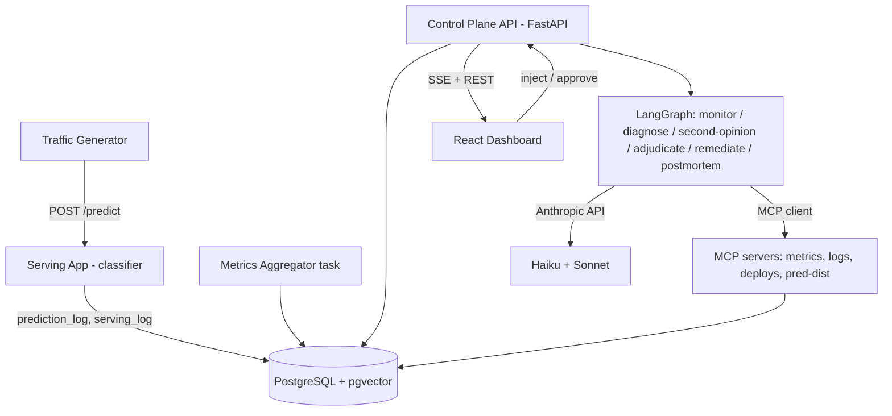

## §01 · Concept

A multi-agent system that supervises a live ML model. A FastAPI service serves a small image classifier under continuous synthetic traffic; an injection harness introduces labeled faults (feature drift, latency degradation, bad deploy, label skew). Agents running in one LangGraph process detect incidents, diagnose root cause through custom MCP tool servers, propose risk-gated remediations, and write postmortems that feed future diagnoses. Every agent run is metered for tokens, dollars, and latency, and a scored eval harness replays a labeled incident suite. Core flow: inject fault → monitor opens incident → diagnosis produces cited hypothesis → remediation queued → human approves → postmortem appears.

## §02 · Architecture



**Data model** (full target stated upfront; implementations stubbed):

- deploy — id, model_version, artifact_path, deployed_at, is_active, is_faulty (hidden ground truth)
- reference_profile — id, model_version, class_distribution (jsonb), mean_confidence
- prediction_log — id, ts, model_version, predicted_class, confidence, latency_ms, input_ref
- serving_log — id, ts, level, message, context (jsonb)
- metric_window — id, window_start, window_end, request_count, latency_p50/p95/p99, mean_confidence, prediction_entropy, psi_score, class_distribution (jsonb)
- injection — id, fault_type, params (jsonb), started_at, ended_at, ground_truth_fault
- incident — id, opened_at, closed_at, status (open|diagnosing|awaiting_approval|remediating|resolved), severity, trigger_metrics (jsonb)
- agent_run — id, incident_id (nullable), agent_name, model, input_tokens, output_tokens, cost_usd, latency_ms, status, created_at
- hypothesis — id, incident_id, agent_run_id, fault_type, confidence, evidence (jsonb: tool-call citations), kind (primary|second_opinion|adjudication)
- remediation — id, incident_id, hypothesis_id, action_type (rollback|retrain_trigger|pipeline_fix), risk (low|medium|high), status (pending|auto_executed|approved|rejected|executed|failed), created_at, executed_at
- postmortem — id, incident_id, body_md, embedding vector(384), created_at
- eval_run — id, started_at, finished_at, suite_version, detection_recall, diagnosis_accuracy, mean_ttd_s, mean_cost_usd
- eval_case — id, eval_run_id, scenario_name, injected_fault, detected (bool), diagnosis_correct (bool), ttd_seconds, cost_usd

**API surface** (all stubbed at skeleton; JSON response shapes are typed Pydantic stubs):

Serving app: POST /predict (image → {class, confidence}); GET /healthz.

Control plane, prefix /api:
- GET /metrics/windows?since= — windowed metrics
- GET /injections · POST /injections · POST /injections/{id}/stop
- GET /deploys · POST /deploys/activate — {model_version}
- GET /incidents · GET /incidents/{id} — incident + hypotheses + remediations + agent runs
- POST /remediations/{id}/approve · POST /remediations/{id}/reject
- GET /postmortems · GET /postmortems/{id}
- GET /agent-runs · GET /costs/summary
- POST /eval/runs · GET /eval/runs · GET /eval/runs/{id}
- GET /events — SSE stream

No auth (explicitly deferred to post-MVP). Cross-origin: dev allows http://localhost:5173 only; no cookies — no credentials needed. CORS middleware registered outermost (registration order documented in code comment; see gotchas).

## §03 · Tech Stack

- Python 3.12, Node 20
- Backend: FastAPI, SQLAlchemy 2 (async, asyncpg), Alembic, LangGraph, anthropic SDK, mcp Python SDK
- Model: PyTorch + torchvision (small CNN, CIFAR-10 weights checked in)
- Embeddings: sentence-transformers all-MiniLM-L6-v2 (local, 384-dim — no extra API key)
- DB: PostgreSQL 16 + pgvector (Docker Compose)
- Frontend: React 18, Vite, TypeScript, TanStack Query, Recharts, react-router
- Version pinning deferred to iterations where it matters

## §04 · Backend

```
backend/
  app/
    main.py            # FastAPI app, CORS, routers
    config.py          # pydantic-settings (see cached-config gotcha)
    db/ (models.py, session.py, migrations/)
    routers/ (metrics.py, injections.py, deploys.py, incidents.py,
              remediations.py, postmortems.py, evals.py, events.py, costs.py)
    agents/ (graph.py stub)
    tasks/ (traffic.py, aggregator.py — stubs)
serving/
  app/ (main.py, model.py, middleware.py)
mcp_servers/           # empty package, populated ITER_02
```

Representative stub pattern (per route group):

```python
@router.get("/incidents", response_model=list[IncidentOut])
async def list_incidents(db: AsyncSession = Depends(get_db)):
    return []  # stub — real query in ITER_02
```

Run: docker compose up -d db && make dev (starts control plane :8000, serving :8001).
Env vars (names only): DATABASE_URL, ANTHROPIC_API_KEY, MODEL_CHEAP, MODEL_STRONG, SERVING_URL, CORS_ORIGINS.
Alembic configured against the async engine via the sync bridge from day one (see gotchas); all models imported in db/models.py registry so autogenerate sees them.

## §05 · Frontend

Screens/routes: / dashboard (live metrics), /incidents, /incidents/:id, /inject, /approvals, /postmortems, /costs, /evals.

Component tree (top level): App → Layout (Sidebar, Header) → route pages; shared: MetricChart, IncidentTimeline, EventFeed, ApprovalCard, ScorecardTable. Chart/config objects defined at module level (stable-reference gotcha).

Run: npm run dev (Vite, :5173, proxy to :8000).
Placeholder strategy: pages render with hardcoded sample data behind a USE_STUBS flag. UI convention (stated once, applies family-wide): controls for later-iteration features are omitted entirely until their iteration ships them — no disabled placeholders.

## §06 · LLM / Prompts

Used for: incident detection triage, root-cause diagnosis, second opinion, adjudication, remediation proposal, postmortem writing. Provider: Anthropic. Tiers: MODEL_CHEAP (Haiku) for monitor, MODEL_STRONG (Sonnet) for diagnosis/adjudication/postmortem. Stub system prompt: "You are an MLOps incident agent. <role TBD in ITER_02>". I/O shapes: monitor in = latest metric_window JSON + baseline → out = {open_incident, severity, reason}; diagnosis out = typed Hypothesis {fault_type, confidence, evidence: [tool_call citations]}. All agent output validated against Pydantic schemas.